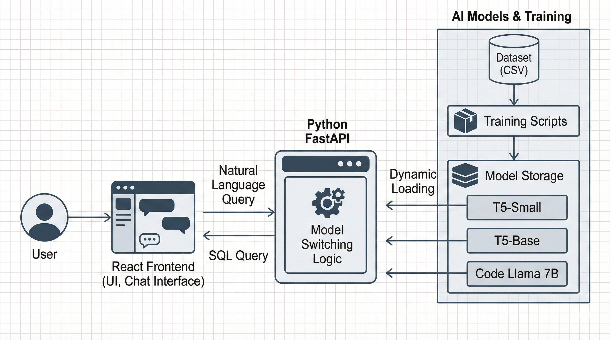

# NLP-to-SQL Translation System (Deep Learning Final Project)

An advanced end-to-end solution for converting natural language queries into SQL, featuring dynamic model switching between **T5-Small**, **T5-Base**, and **Code Llama 7B (QLoRA)**.

## 🚀 Key Features

*   **Dynamic Model Switching**: Instantly switch between lightweight baseline models (T5) and high-performance LLMs (Code Llama) via the UI.
*   **Resource-Aware Inference**: Includes warning systems for high-VRAM models (Code Llama) to prevent system crashes on consumer hardware.
*   **Modern Interactive UI**:
    *   **Dark Mode** support for comfortable coding at night.
    *   **Memo Box** for storing query snippets, notes, and copied SQL.
    *   **Segmented Control** for intuitive and visual model selection.
    *   **Safety Features** like "Clear Chat" with confirmation dialogs.
*   **Robust Backend**: FastAPI server handling dynamic model loading and offloading to optimize GPU memory usage.


---

## 🏗️ Architecture

*   **Frontend**: React (TypeScript), Redux Toolkit, Material UI, Framer Motion.
*   **Backend**: Python FastAPI, PyTorch, Transformers (HuggingFace), PEFT (LoRA/QLoRA).
*   **Models**:
    1.  **T5-Small**: Fast, lightweight baseline (trained on CPU/low-end GPU).
    2.  **T5-Base**: Balanced performance model.
    3.  **Code Llama 7B**: 4-bit Quantized (QLoRA) for state-of-the-art reasoning on 8GB VRAM GPUs.

---

## 🛠️ Installation & Setup

### Prerequisites
*   Python 3.10+
*   Node.js 16+
*   NVIDIA GPU with CUDA support (Recommended: 8GB+ VRAM for Code Llama)

### 1. Clone Repository
```bash
git clone <repo-url>
```

### 2. Backend Setup
**Important for Windows Users**: This project uses `bitsandbytes` for 4-bit quantization. On Windows, you must install a specific pre-built wheel.

```bash
cd back-end
# Create and activate virtual environment
python -m venv .venv
source .venv/bin/activate  # or .venv\Scripts\activate on Windows

# Install standard dependencies
pip install -r requirements.txt

# WINDOWS ONLY: Install bitsandbytes with CUDA support
pip install https://github.com/jllllll/bitsandbytes-windows-webui/releases/download/wheels/bitsandbytes-0.41.1-py3-none-win_amd64.whl
```

### 3. Frontend Setup
```bash
cd front-end/nl2sql
npm install
```

---

## 🧠 Model Training

This repository includes the scripts used to fine-tune the models. You can reproduce the training process locally.

### Training Process
To train a specific model, run the corresponding script in the `model_training` directory:

```bash
# Train T5-Small
python model_training/train_t5_small.py

# Train Code Llama 7B (Requires GPU)
python model_training/train_7b_qlora.py
```

### ⚠️ Note on Model Weights
Successfully running these scripts will generate trained model files (e.g., `model.safetensors`, `pytorch_model.bin`) inside the `model_training/t5_small/`, `model_training/t5_base/`, etc. directories.

**Important:** These generated model weights are **too large** to be uploaded to GitHub. They are automatically configured to be **ignored** by this repository's `.gitignore`. 
*   If you are cloning this repo, you will need to re-train the models locally or obtain the weights from an external source if provided.
*   The application expects these files to exist in their respective folders to function correctly.

---

## 🏃 Usage

### Start Backend
```bash
cd back-end
uvicorn main:app --reload
```
*   Server runs at: `http://localhost:8000`
*   Swagger Docs: `http://localhost:8000/docs`

### Start Frontend
```bash
cd front-end/nl2sql
npm start
```
*   App runs at: `http://localhost:3000`

---

## 📂 Project Structure

*   **`back-end/`**: FastAPI server (`main.py`) and `query_handler` logic for loading models dynamically from the training directory.
*   **`front-end/`**: React application source code.
*   **`model_training/`**: Contains training scripts (`train_t5_small.py`, `train_7b_qlora.py`) and the saved model artifacts (`t5_small`, `codellama_7b_QLoRA`).
*   **`result_summary/`**: Evaluation reports and detailed training logs.

## 📊 Model Evaluation
For a detailed performance comparison between T5 and Code Llama, including VRAM usage and accuracy metrics, please refer to [comprehensive_model_evaluation.md](./result_summary/comprehensive_model_evaluation.md).
